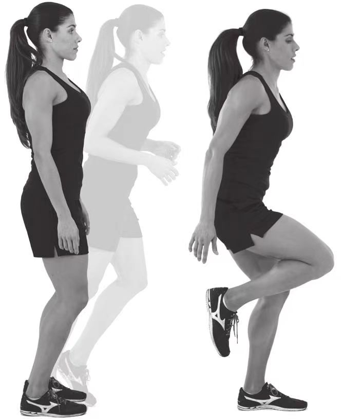
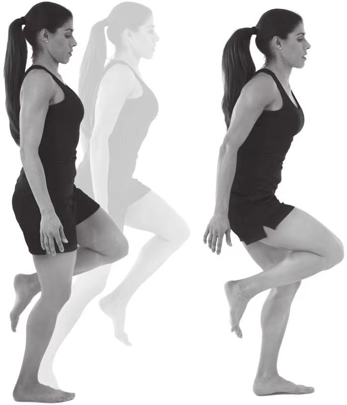

# 关键跑姿

1. 成弹性站姿。
2. 保持弹性站姿，以前脚掌为支点开始向前落下，使臀部（身体重心）的垂直位置超过支撑脚的跖球部（这是关键跑姿的重力支撑点）。这将是你失去身体重心的临界点，一旦超过这个临界点，支撑脚的脚跟就会抬离地面，身体也因失去平衡而向前倾倒。将注意力集中在阻止身体继续向前落下、维持身体平衡的肌肉上，然后让身体在重力作用下作为一个整体继续向前倾。

3.随着重力逐渐发挥作用，你面临两个选择：一个是放任身体继续向前落下而摔倒，另一个是向前迈步，防止摔倒。我的建议是向前迈一步。4.身体成关键跑姿，重复上述步骤。向前落下时要保持关键跑姿，将身体作为一个整体向前倾斜落下，最终使重心超过支撑点（支撑脚的跖球部）。在此过程中，要集中精力感知身体重心的变化。

    
     
    
自由落下成关键跑姿

    
     
    
自由落下成关键跑姿并转换支撑脚

