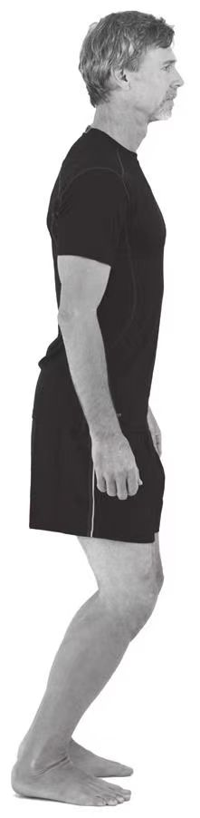

# 弹性站姿

1. 脱掉鞋。
2. 将体重集中在你的跖骨球上。
3. 屈膝，使膝关节位于脚趾的正上方。
4. 稍微向前倾斜身体，使肩关节在髋关节的上方，而髋关节又正好处在跖骨球的上方。这时，身体的跖骨球、髋关节、肩关节、耳朵都处在一条垂直于地面的直线上。
5. 曲臂，前臂处在腰部和肩部之间。
6. 调动从臀部到肩部的核心肌群，收腹，让肚脐贴近脊柱，同时让肩胛骨互相靠拢。这就是关键跑姿的核心，今后的学习中，你会对它有更深入的了解。
7. 保持头部正直，眼向前看。
8. 心理上给自己一个准备行动的暗示，就像在比赛中等待响枪一样。
