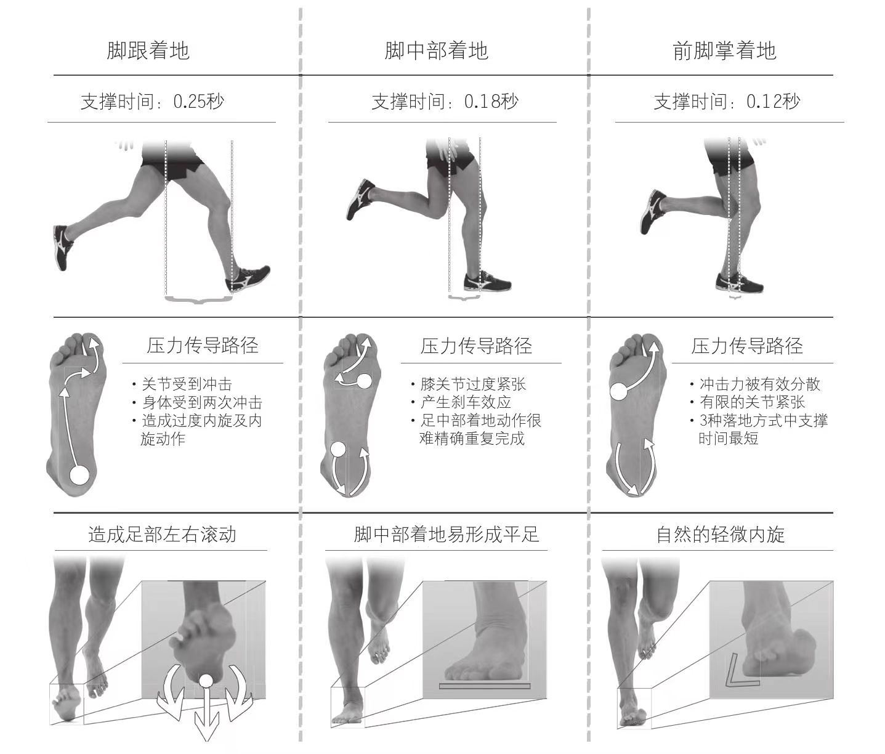

# 技术动作核查清单

##### 这是一个由一系列自我提问组成的主要技术动作核查清单，这个清单并不仅仅供这节课中使用，在你觉得自己动作出现问题的任何时候都可以拿出来核对一下。一旦发现自己很难感知某个身体姿态时，立刻停下，进行相关的技术练习后再重新开始跑步。

1. 如何感知关键跑姿？我是否以落地脚的跖球部着地？我是否在支撑脚的跖球部感到了压力？在支撑阶段，我的摆动脚是否位于臀部下方？在跑步时我是否能保持身体放松？脚的着地点是否在臀部的正下方？我的膝关节是否始终处于微屈状态以保持肌肉的弹性？我的身体姿态是否与跑速相符？
2. 如何感知落下？跑步时我是否感到踝关节的紧张？我是否感觉到了毫不费力的身体前移？我在前倾的过程中是否保持了关键跑姿？我是否能够完全自然地做出关键跑姿？我是否感觉到了身体某个部位的肌肉紧张？我身体任何部位的动作是否对跑步产生了制动效果？我是否有勇气尝试加大身体前倾的角度？
3. 如何感知上拉？我是否将支撑腿直接上拉到了臀部下方？我如何感觉到了落下阶段的结束？我是否能觉察到开始上拉动作的最佳时机？我是否能根据跑速以恰当的力量完成上拉动作？

    
     
    
几种不同着地方式的对比

