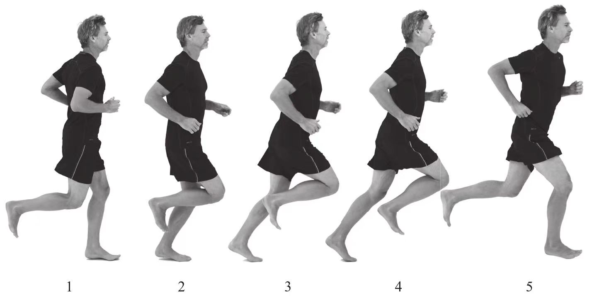

# 整合3个基本姿态

为了将关键跑姿、落下和上拉这3个基本姿态整合为一个连贯、高效的跑步动作，需要不断提高你的知觉能力。不要期望现在就能将动作做得完美无缺，旧的习惯性动作不会立即消失，在掌握新的跑步技术的过程中感到一些困惑或怀疑是很正常的事。让我们回到本书最开始提到的3个基本姿势，下图呈现的就是一个单腿动作周期的动作过程，请仔细观看并牢牢记住它们。

    
     
    
1.脚掌刚落地 2.成关键跑姿 3.当身体开始落下时，支撑脚脚跟离开地面 4.当摆动脚超过支撑腿并上拉后腿时，落下过程结束5.腾空阶段

