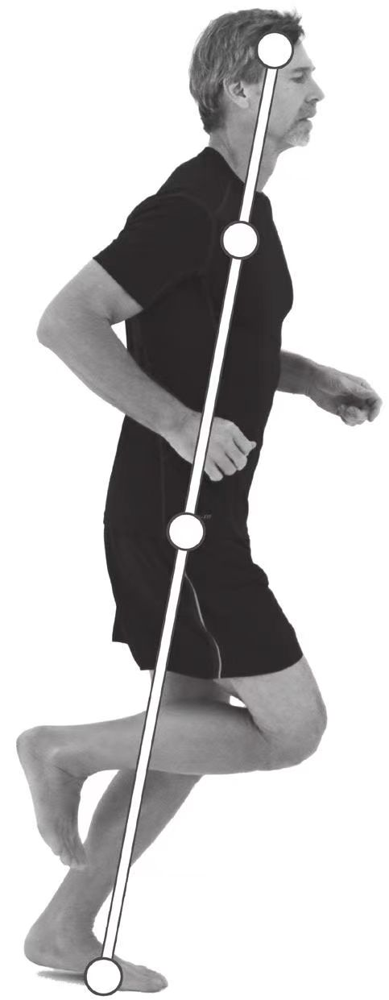

# 关键跑姿的身体重心知觉练习

1. 身体成关键跑姿。
2. 感觉身体重心在支撑脚跖球部产生的压力，注意识别关键跑姿与双足站立姿势有什么不同。身体成姿势跑法的关键跑姿时，支撑脚的跖球部、髋关节、肩关节和头部应成一条直线。此时，哪一个部分比较薄弱？
3. 将体重平均分布在支撑脚的全脚掌，或是将身体重心在支撑脚的脚趾、脚跟、跖球部以及脚的内外侧之间来回转换，体会在每次转换时哪些肌肉被调动起来了。
4. 重新将身体重心集中在支撑脚的跖球部，还原关键跑姿。
5. 变换支撑腿，重复上述动作，体会两腿感觉是否有所不同。
关键跑姿的静态练习