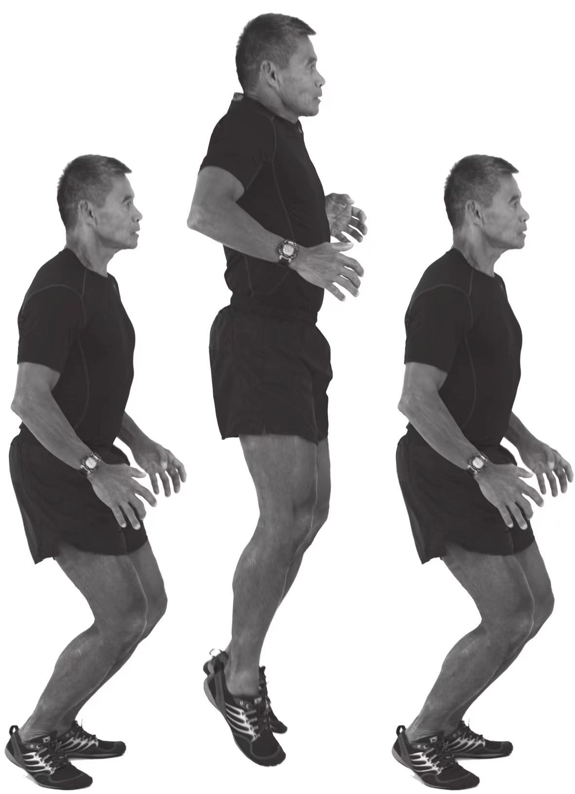

# 前向定点跳跃练习

1. 身体成弹性站姿。
2. 将臀部（身体重心）前移超过你的身体支撑点（你的脚部），使身体向前倾斜。
3. 向前跳起以重新获得身体平衡。注意，不要用脚趾主动蹬离地面或是主动收缩小腿肌肉。这个跳跃动作和立定跳远不同，不是尽量向前跳跃。跳跃动作的向前动力是由身体的前倾和在跳跃过程的耸肩动作协助下产生的。跳跃前身体向前倾斜的角度越大，跳出的水平距离越远。
4. 用着地脚的跖球部着地，着地后，脚后跟顺势落下轻微接触地面。
5. 向前连续跳跃一段距离，跳跃时一定要在身体重量落在脚的跖球部以后，再开始下一个跳跃动作。