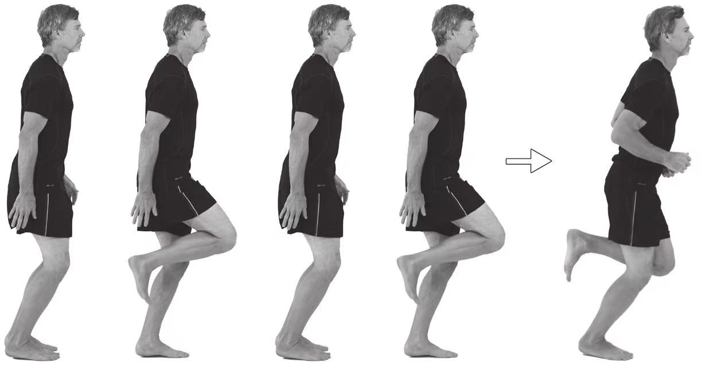

# 原地单腿点地练习

1. 左腿支撑，身体成[关键跑姿](../技术动作/关键跑姿.md)。
2. 右脚在臀部下方点击地面后，通过腘绳肌的收缩将右脚重新由地面上拉到臀部下方。在动作过程中左脚要始终与地面接触。
3. 保持[关键跑姿](../技术动作/关键跑姿.md)，右脚的落下是由前脚掌首先触地，这是一个快速的点击动作。
4. 右脚前脚掌触地后，脚跟顺势落下，轻轻接触地面。
5. 重新收缩腘绳肌将右脚上提到臀部，同时耸肩以抵消一部分重力作用。在动作过程中要保持股四头肌的放松。右脚的运动轨迹是一条垂直于地面的直线。
6. 快速重复上述动作。尽量减少右脚与地面的接触时间，动作节奏是：快速上拉、慢速落下。左脚应自始至终与地面接触。
7. 随着动作速度的加快，左脚要随着右脚的每一个上拉和耸肩动作的节奏进行小幅的原地跳跃。注意保持双膝弯曲，右脚着地时始终要以跖球部首先接触地面。
8. 变换支撑腿重复上述动作。

