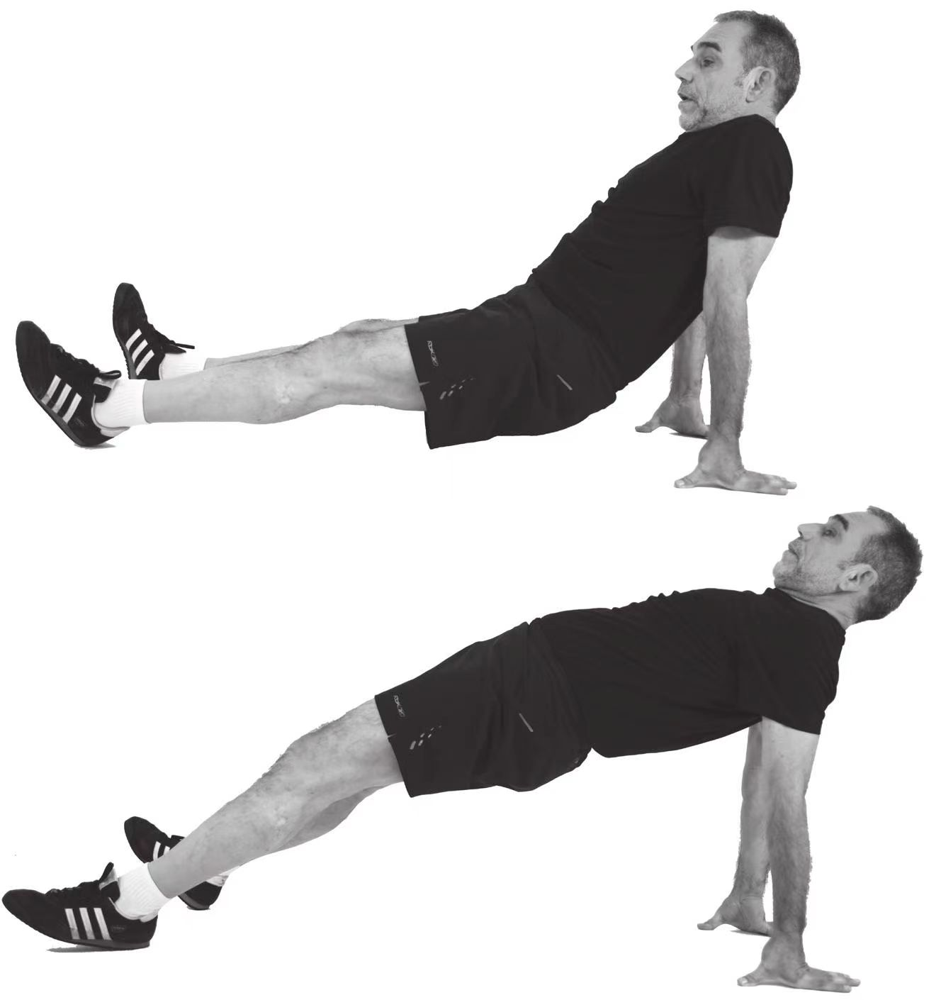
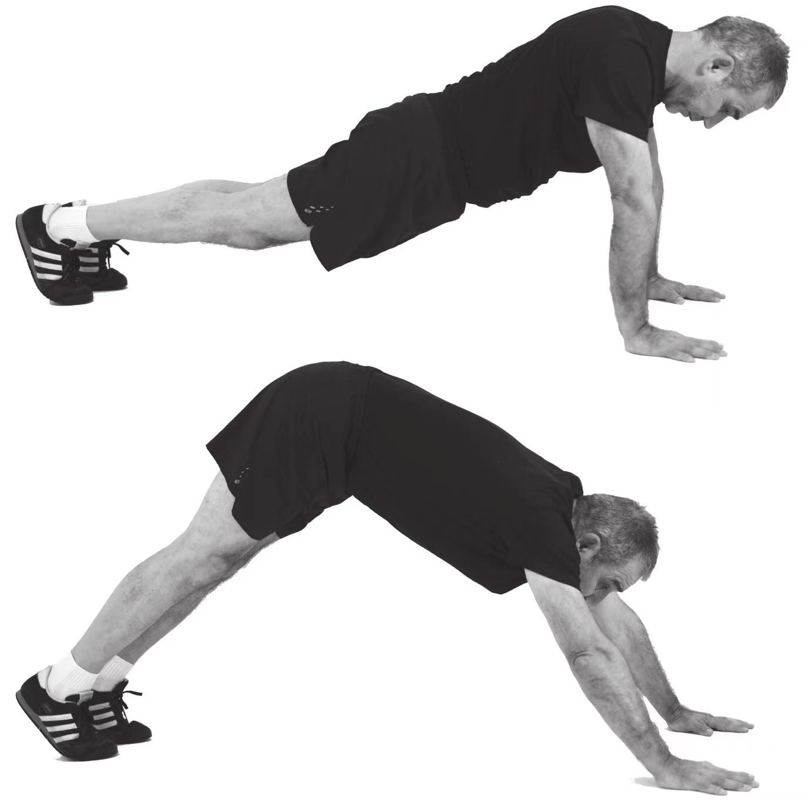
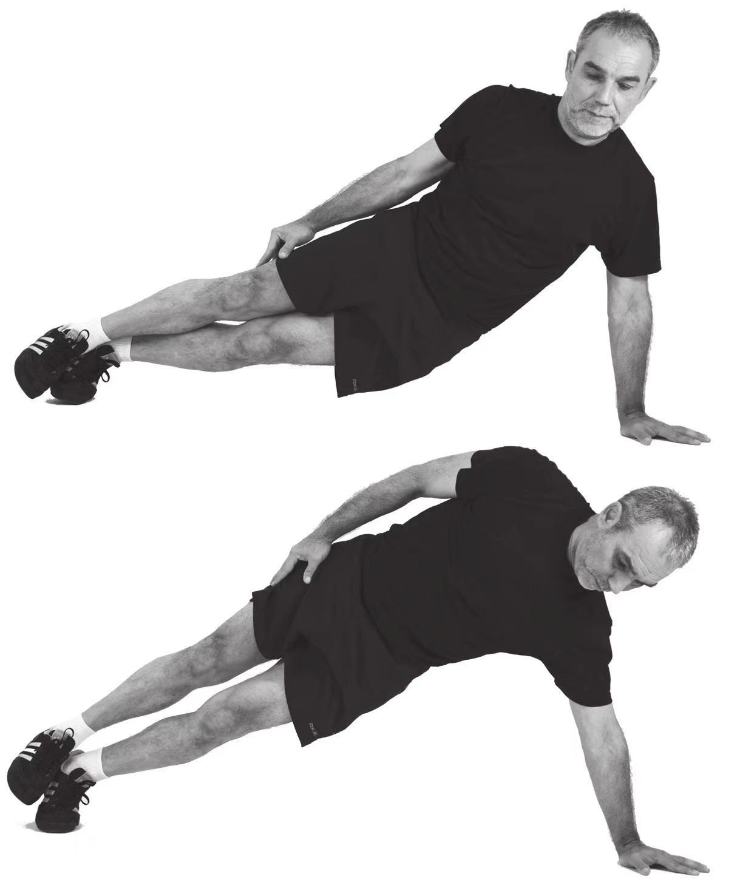
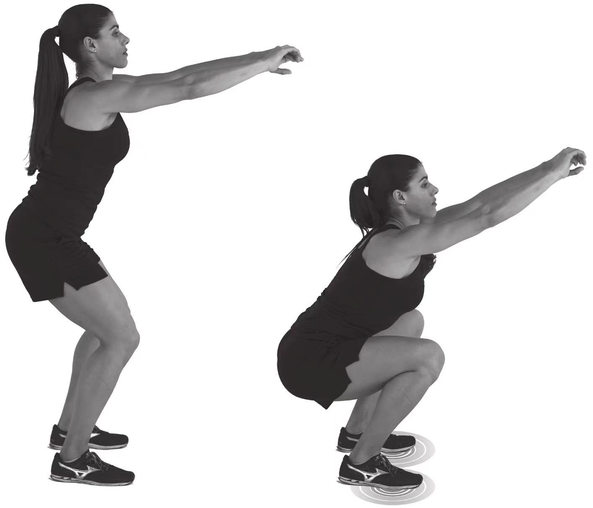

# 常规4种力量训练

## 仰面抬臀

► 坐在地板上，双手放在身后，位于同侧肩关节正下方（掌心向下，指尖指向侧后方），双腿于体前伸直。
► 尽可能高地抬起臀部，只用双手和双脚脚跟支撑体重。
► 还原到初始姿势，重新抬臀重复10次。每组的动作次数逐星期递增。

## 俯卧抬臀

► 俯卧撑姿势，双手在两侧肩关节正下方，手臂伸直，身体成一直线，双脚勾脚尖触地。
► 尽量将臀部抬高，使身体成一个倒“V”字形。
► 还原至初始的俯卧撑姿势，重复10次。

## 侧身抬臀

► 右臂伸直于体侧，左臂伸直于左肩下方支撑上体重量，臀部接触地面。
► 将臀部尽可能高地抬向空中。
► 臀部降低到起始姿势，重复10次。
► 换另一只手再做10次。

## 深蹲

► 站立，两脚间距略大于肩宽，双臂伸直抬起，与肩同高，用双脚前脚掌支撑体重。
► 保持上身挺直，曲腿，尽量成深蹲姿势，双脚脚跟不要离开地面。
► 还原到初始姿势，重复10次。