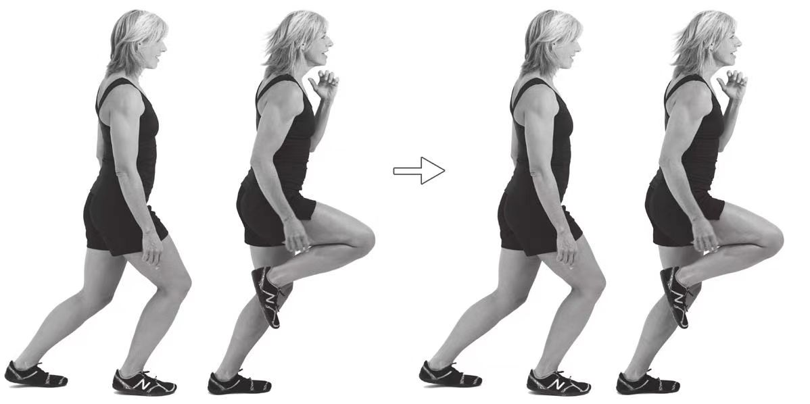

# 移动中单腿点地练习

1. 以[原地单腿点地练习](./原地单腿点地练习.md)为基础，从关键跑姿开始，右脚落下在臀部下方，以跖球部首先接触地面，顺势落下直至脚跟轻轻触地。
2. 在耸肩的协助下收缩腘绳肌，迅速将右脚上拉到臀部下方。同样，保持股四头肌的放松。右脚的运动轨迹应该是一条垂直于地面的直线。
3. 身体前倾使臀部超过身体的支撑点，即左脚的跖球部。
4. 保持左腿放松，在臀部下方落右腿，并以右脚的前脚掌点地。同时，左脚在臀部下方迅速向前滑动，滑动停止后，在新的位置作为支撑腿重新支撑体重。
5. 重复上述动作，尽量减少右脚与地面接触的时间。
6. 随着动作速度的加快，左脚要随着右脚的每一个上拉和耸肩动作的节奏进行小幅的向前跳跃。注意保持双膝弯曲，右脚着地时始终要以跖球部首先接触地面。
7. 变换支撑腿重复上述动作。

