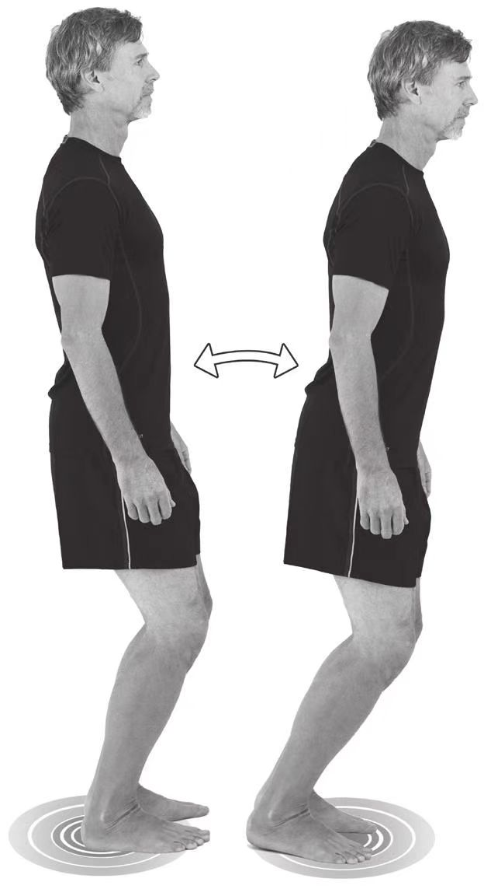

# 第一课 脚

1. 赤足，成[弹性站姿](../技术动作/弹性站姿.md)，调整身体使之达到可以向任何方向随时运动的状态。
2. 慢慢围绕脚部移动身体重心，从前到后，从一边到另一边，然后环绕运动，像表的指针那样。
3. 将身体重心集中在脚的不同部位：
* 前脚掌。
* 脚跟。
* 平均分担给脚跟和前脚掌。
* 双脚的外侧。
* 双脚的内侧。
4. 重新将重心集中在最佳位置：前脚掌。
5. 逐渐加快速度重复上述动作。