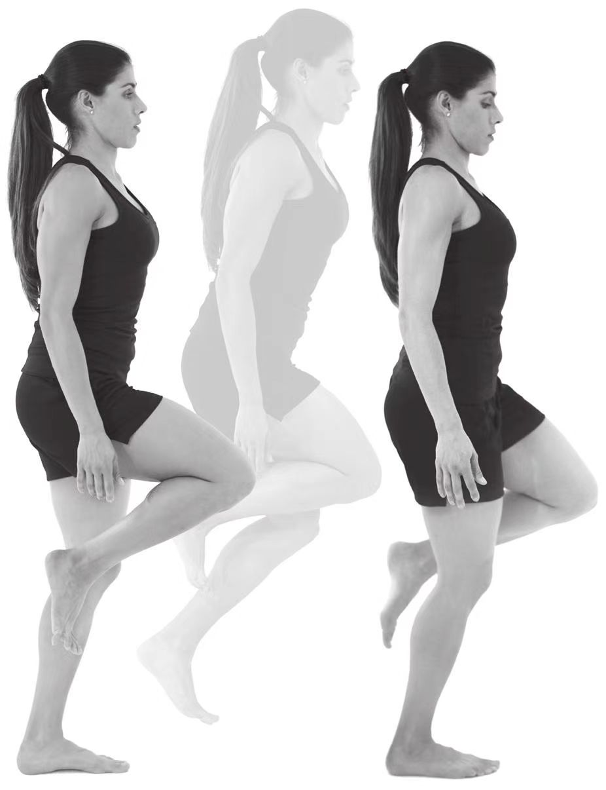

# 转换支撑练习

1. 左腿支撑成[关键跑姿](../技术动作/关键跑姿.md)，集中精力在右脚落地前，将支撑脚从地面上拉到臀部下方这个动作过程。
2. 在身体前倾落下的同时右腿向前摆动。
3. 在右脚前摆超过左腿的同时，将左脚提到臀部下方，这个动作应在右脚落地之前完成。在身体腾空时，将体重转移到即将落地的右腿上。在转换支撑的过程中，适当提肩会对支撑腿离开地面有所帮助。
4. 右脚应在没有任何肌肉主动用力的情况下，自然地以前脚掌落地，完成支撑腿的转换。落地后身体成关键跑姿。
5. 重复上述动作：右腿支撑成关键跑姿，身体前倾落下，提右脚到臀下，左脚以前脚掌落地转换支撑腿，身体成关键跑姿。