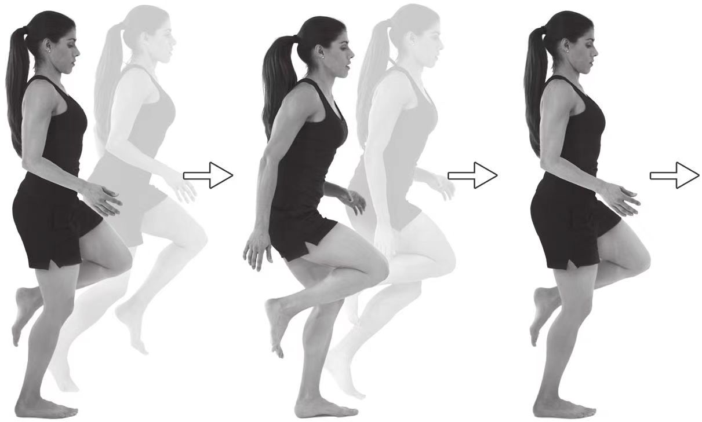

# 运动中的转换支撑练习

1. 以右腿为支撑，身体成关键跑姿。
2. 将注意力集中在转换支撑动作的同时开始向前移动臀部。
3. 身体向前倾，将臀部向前移动，使其超过身体重心的支撑点，即脚的跖球部）。
4. 在将右腿上拉到臀部下方的同时，提肩以缓解身体的重力作用，此时侧看双腿呈数字4的形状。
5. 以左脚的前脚掌着地，在将脚跟落下轻触地面然后再抬起的过程中，肌肉-肌腱的弹力机制通过伸展和回弹完成能量的吸收和释放。此时，臀部应处在支撑脚的正上方，左腿弯曲与身体呈S形。
6. 一旦你的全部体重集中于左脚的跖球部，马上前倾身体，将身体重心前移超过支撑脚的位置。